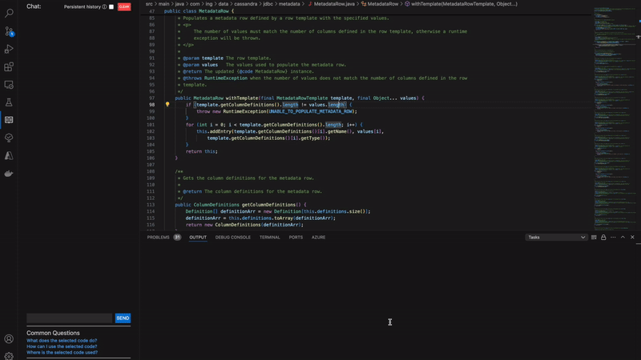

# Using LLMs to aid developers with code comprehension in codebases
This repository contains the source code for the VSCode LLM plugin used for my Master thesis "Using LLMs to aid developers with code comprehension in codebases".

## Info
This repository contains two directories responsible for different parts of the plugin. The first directory, `vector-embedding`, is used to generate vector embeddings for a codebase and provides these to the frontend using a locally running chroma vector database. The second directory, `vscode-llm-plugin`, is the actual VSCode plugin, and is responsible for any interactions between the user and the LLM. This includes generating the prompt, as well as making calls to the (locally running) Ollama LLM. For more in depth explanations about what certain parts of the code do, feel free to refer to my Master thesis.

### Usage
After setting up the extension, its usage is relatively simple. With the extension pane opened, select a piece of code and ask a question about the piece of code you just selected. In the background, the plugin will then generate the prompt and pass this to the LLM, returning an answer. The gif below shows this interaction.

## Setup
### Ollama
1. Download Ollama (at least version v0.1.26 to support nomic text embedding)
2. Start Ollama (using `ollama serve` in a terminal)
3. Pull the following models in Ollama:
    * `ollama pull nomic-embed-text` (274MB)
    * `ollama pull llama3:instruct` (4.7GB)

### Chroma
NOTE: Make sure Ollama is running, with `nomic-embed-text` installed, as that's used when generating vector embeddings.

4. (Optional, but recommended) Create a virtual environment for python 3.11.8 by running `python3 -m venv venv` (IMPORTANT: The python version CANT be 3.12, since chromadb is not supported yet as of developing this)
5. Install requirements with `pip install -r requirements.txt`
6. Change the directory of the project you want to generate embeddings for in `vector-embedding/setup.py`
7. Run `vector-embedding/setup.py` to generate vector embeddings for the project set in step 6.
8. Start chroma by running `chroma run --path vector-embedding/multiple`

### Plugin - VSIX
The first way to run the plugin is by using the provided VSIX file inside the `vscode-llm-plugin` folder.

9. Go to the `Extensions` tab in VSCode
10. Click the three dots in the top right of the extensions pane > `Install from VSIX...`
11. Find the VSIX file `llm-code-comprehension-0.0.1.vsix` in the `vscode-llm-plugin` directory

### Plugin - dev
The second way is to manually build and run the plugin using VSCode's extension development.

9. Install npm dependencies by running `npm i` in the `vscode-llm-plugin` folder
10. To start the plugin, run extension.ts with VS Code Extension Development (f5 > select `VS Code Extension Development` as interpreter)
11. If there are problems with starting the plugin, try to run `npm run package`

### Java
12. Lastly, make sure Java is installed, as it is needed to get certain types of contect for the prompt. At the time of development, Java 17 was used. (Specifically openjdk 17.0.9 2023-10-17)
